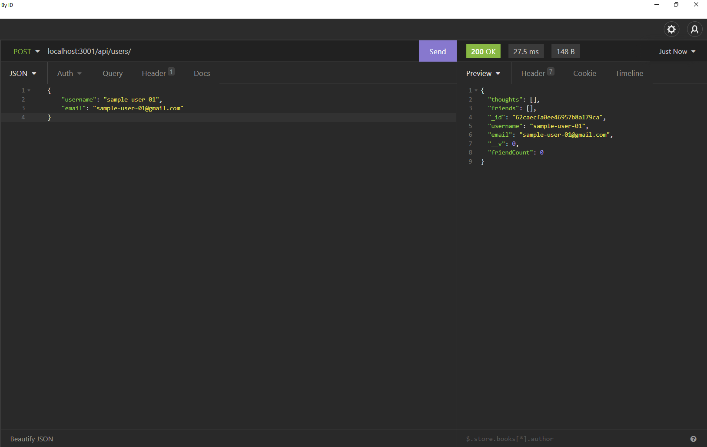
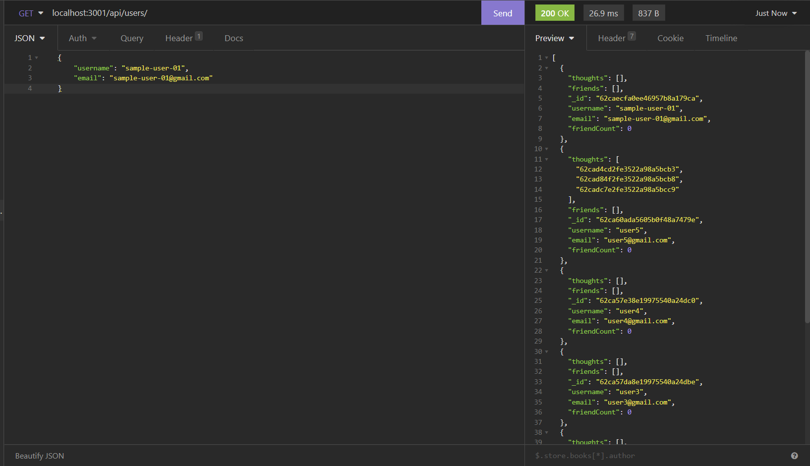
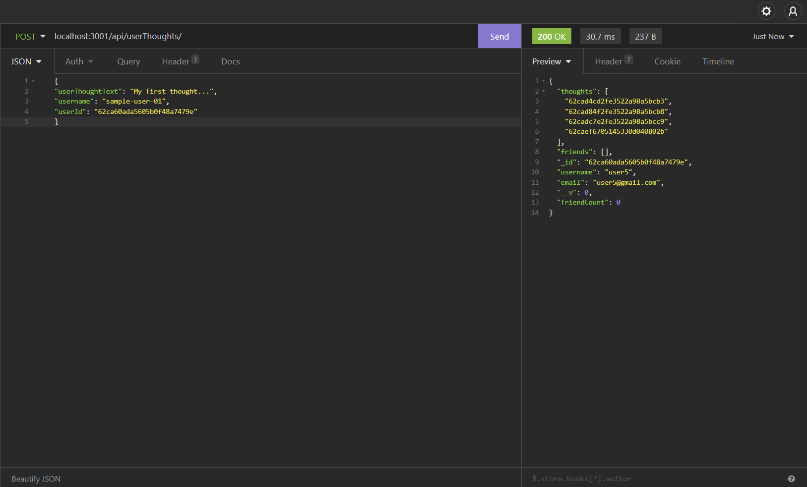

# NoSQL-social-network-api


## Table of Content

- [Description](#description)
- [Preview](#preview)
- [Installation](#installation)
- [Tests](#tests)
- [Features](#features)
- [Tools and Dependencies Used](#tools-and-dependencies-used)
- [Contributing](#contributing)
- [License](#license)
- [Questions](#questions)

## Description

This is a node.js API for a social media network that uses MongoDB to handle large volumes of unstructured NoSQL data.  
Users have the ability to add, delete, get and update their users, friends of users, thoughts, and reactions on those thoughts.

## Preview

### Create User



### Get All Users



### Create User Thought



### Get All User Thoughts


## Installation and Deployment

# 📦

## Installation

This repo is not intended to be deployed. In order to use this application, simply git clone the repo to your local so that you have the Node project there on your local machine , and then follow the following instructions to install and run it

1. Download the repo files from the link below

- You can clone the most recent version of repo into your machine
- [Github](https://github.com/chris6661/18-NoSQL-Social-Network-API)

2. Make sure you have mongoDB installed on your machine
3. Execute the following command at the command line

```
. Use the following npm install to install the npm package dependencies listed in your package.json.
    - npm init -y
    - npm install express
    - npm install mongoose
    - npm install moment
```

4. To start the server execute the following command at the command line

```
npm start

```

5. Open Insomnia Core and follow the following test instruction to test the API routes.

## Tests:

## Restful API testing with Insomnia Core

`/api/users`

- Use `GET` all users
- Use `POST` a new user:
  ```json
  // Create new user sample data
  {
    "username": "user-001",
    "email": "user-001@yahoo.com"
  }
  ```

---

**`/api/users/:userid`**

- Use `GET` user by `id`
- Use `PUT` to update a user by `id`
- Use `DELETE` to remove user by `id`

---

**`/api/users/:userId/friends/:friendId`**

- Use `POST` to add a new friend
- Use `DELETE` to remove a friend

---

**`/api/userThoughts`**

- Use `GET` to get all user thoughts
- Use `POST` to create a new user thought
  ```json
  // Use the following sample data to create and get user thoughts
  {
    "thoughtText": "My test thought...",
    "username": "user-001",
    "userId": "user id"
  }
  ```

---

**`/api/userThoughts/:thoughtId`**

- Use `GET` to get a single thought by `id`
- Use `PUT` to update a thought by`id`
- Use `DELETE` to remove a thought by `id`

---

**`/api/userThoughts/:thoughtId/reactions`**

- Use `POST` to create a reaction
  ```json
  // sample data for reaction
  {
    "reactionBody": "My first sample reaction!!",
    "username": "user-001"
  }
  ```

---

**`/api/thoughts/:thoughtId/reactions/:reactionId`**

- Use `DELETE` to remove a reaction by `reactionId`

## Features

# 📋

⚡️ Accesible
⚡️ Efficient
⚡️ Easy to read
⚡️ Easy to modify

## Sections

## Tools and Dependencies Used

# 🛠️

    ✔️ JavaScript ES6
    ✔️ Node.js
    ✔️ Express.js
    ✔️ mongoose
    ✔️ moment
    ✔️ NoSQL
    ✔️ MongoDB

## Contributing

# 💡

It would be great if you could contribute in any way

- 👯 Git clone the repo to your local machine
- 🔨🔨🔨 Develop your code
- 🔃 Create a new pull request.

## License

    MIT license has been applied to this project

## Questions

    If you have any questions, feel free to contact me via the following contact information:

- Emain: emandaabyou@gmail.com
- GitHub account: [ghashe](https://github.com/ghashe)
- Linkedin: https://www.linkedin.com/in/abyou-geletu-5ba16622b

---

_This README has been generated by ❤ [Professional-README-generator](https://github.com/ghashe/professional-README-generator) © 2022_

---

```

```
